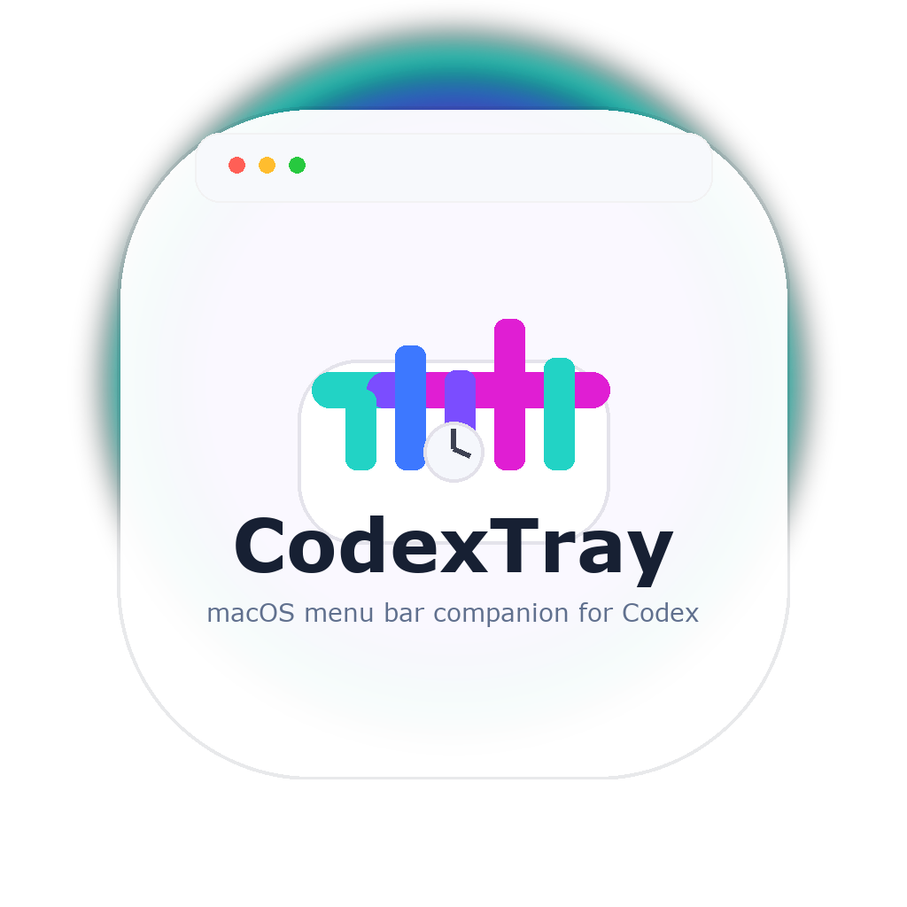
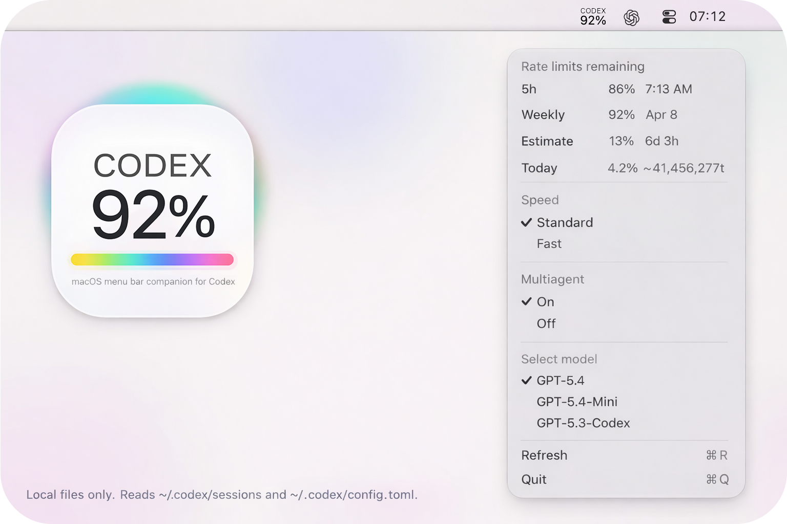

<p align="center">
  
</p>

# CodexTray

CodexTray is a macOS menu bar companion for Codex.

It reads your local Codex session logs and config from `~/.codex`, then shows your current rate limits, model, speed, and multiagent settings in a lightweight status item.

Inspired by the Codex experience. Not affiliated with OpenAI.

Live preview: https://acast.github.io/CodexTray/

<p align="center">
  
</p>

## What it does

- shows current rate-limit usage from local Codex session logs
- shows estimated remaining time and daily usage
- lets you switch models from the menu bar
- lets you toggle speed and multiagent mode
- stays local and only reads files on your Mac

## Requirements

- macOS 13+
- Swift 6+
- Codex installed locally with session logs in `~/.codex`

## Build and run

```bash
swift run CodexTray
```

To build the app bundle:

```bash
./build-app.sh
```

## Autostart

Install the LaunchAgent with:

```bash
./install-autostart.sh
```

## Notes

- The app reads only local files from `~/.codex/sessions` and `~/.codex/config.toml`.
- The repo avoids hardcoded machine-specific paths.
- The LaunchAgent plist is generated from a template so you can install it on any Mac.
